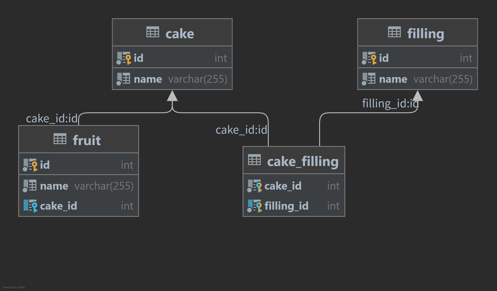

# CURD

我们将使用这个基本模式进行演示：

* cake 一对多 fruit
* cake 多对多 filling
* cake_filling 是 cake 和 filling 之间的连接表



---

## 数据查询

### 1. 基础查询：通过主键获取

这是最简单的查询方式。SeaORM 会自动生成 `WHERE id = ?` 语句。

* **`find_by_id(id)`**: 根据主键查找。如果是复合主键，传入元组, eg: `Cake::find_by_id(1).one(db).await?`。
* **`.one(db)`**: 期待返回 0 或 1 条数据。结果会被包装在 `Option<Model>` 中, eg: `let model: Option<cake::Model> = ...`。

```rust,ignore
// 查询主键为 1 的蛋糕
let cheese: Option<cake::Model> = Cake::find_by_id(1).one(db).await?;
// 查询复合主键 (6, 8) 的关联记录
let link: Option<cake_filling::Model> = CakeFilling::find_by_id((6, 8)).one(db).await?;
```

### 2. 条件查询与排序

当需要更复杂的过滤逻辑时，使用 `filter` 和 `order_by`。

* **`find()`**: 开启查询构造器，默认查询所有列, eg: `Cake::find()`。
* **`.filter(condition)`**: 添加过滤条件（如包含、等于、大于等）, eg: `.filter(cake::Column::Name.contains("chocolate"))`。
* **`.order_by_asc / .order_by_desc`**: 设置排序规则, eg: `.order_by_asc(cake::Column::Name)`。
* **`.all(db)`**: 获取所有匹配的结果，返回 `Vec<Model>`, eg: `let cakes: Vec<cake::Model> = ...`。

```rust,ignore
let chocolate_cakes: Vec<cake::Model> = Cake::find()
    .filter(cake::Column::Name.contains("chocolate")) // 名字包含 chocolate
    .order_by_asc(cake::Column::Name)                // 按名字升序
    .all(db)
    .await?;
```

---

### 3. 关联查询（Loading Related Models）

SeaORM 提供了三种方式处理表与表之间的关联查询：

#### A. 延迟加载 (Lazy Loading)

先查主表，需要时再查关联表。**优点**：逻辑清晰；**缺点**：会有多次数据库往返（N+1 问题）。

```rust,ignore
let cake = Cake::find_by_id(1).one(db).await?.unwrap();
// 仅在需要时去查关联的 fruit
let fruits: Vec<fruit::Model> = cake.find_related(Fruit).all(db).await?;
```

#### B. 预加载 (Eager Loading - Join)

使用 SQL 的 `JOIN` 一次性查出所有数据。

* **`find_also_related`**: 用于 1-1 关系，返回元组 `(Model, Option<RelatedModel>)`。
* **`find_with_related`**: 用于 1-N 或 M-N 关系，返回 `Vec<(Model, Vec<RelatedModel>)>`。

```rust,ignore
// 一次性查出蛋糕及其对应的水果（1-N）
let cake_with_fruits: Vec<(cake::Model, Vec<fruit::Model>)> = Cake::find()
    .find_with_related(Fruit)
    .all(db)
    .await?;
```

#### C. 模型加载器 (Model Loader)

如果你已经有一堆主表数据，想批量补全它们的关联项，`Loader` 比 `JOIN` 更节省带宽。

```rust,ignore
let cakes: Vec<cake::Model> = Cake::find().all(db).await?;
// 批量加载所有蛋糕的配料 (M-N)，SeaORM 会自动处理中间表
let fillings: Vec<Vec<filling::Model>> = cakes.load_many(Filling, db).await?;
```

### 4. 分页查询 (Pagination)

处理大量数据时，必须分页。

* **`.paginate(db, page_size)`**: 将查询转为分页器, eg: `.paginate(db, 50)`。
* **`.fetch_and_next()`**: 获取当前页数据并指向下一页。
* **游标分页 (Cursor Pagination)**: 基于列值（如 ID）的翻页，性能远高于传统的 `OFFSET` 分页，适合大数据量或无限滚动界面。

```rust,ignore
// 游标分页：获取 ID > 1 的前 10 条数据
let mut cursor = Cake::find().cursor_by(cake::Column::Id);
cursor.after(1);
let first_pages = cursor.first(10).all(db).await?;
```

### 5. 部分模型查询 (Partial Model)

如果你只需要表中的几个字段（例如用户列表只需姓名，不需要加密密码），使用 `PartialModel`。

* **`#[derive(DerivePartialModel)]`**: 定义一个只包含部分字段的结构体。
* **`.into_partial_model()`**: 告诉 SeaORM 只生成查询这些字段的 SQL，减少网络传输。

```rust,ignore
#[derive(DerivePartialModel)]
#[sea_orm(entity = "cake::Entity")]
struct CakeName {
    name: String,
}
let names: Vec<CakeName> = Cake::find()
    .into_partial_model()
    .all(db)
    .await?;
// 生成的 SQL: SELECT "cake"."name" FROM "cake"
```

---

在 SeaORM 中，如果你想对数据库进行“写”操作（插入、更新、删除），你必须理解 **ActiveModel** 和它的核心组件 **ActiveValue**。

这是 SeaORM 最精妙的设计：它不只是存储数据，还存储了数据的**状态**（这个字段改没改？要不要存入数据库？）。

---

## ActiveModel

### 1. ActiveValue：字段的三种状态

每个字段在 `ActiveModel` 中都被包装成一个 `ActiveValue` 枚举。它决定了生成 SQL 时如何处理该字段。

* `ActiveValue::Set(V)`：**手动设置**。该字段会被包含在 `INSERT` 或 `UPDATE` 语句中。
  * eg: `name: Set("Apple".to_owned())`  SQL 中会出现 `"name" = 'Apple'`。

* `ActiveValue::Unchanged(V)`：**未改变**。通常是刚从数据库查出来的原始值。它**不会**出现在 `UPDATE` 的 `SET` 子句中，但会作为主键用于 `WHERE` 条件。
  * eg: 从数据库查出 ID 为 1 的数据，`id` 状态就是 `Unchanged(1)`。

* `ActiveValue::NotSet`：**未定义/忽略**。该字段完全不参与 SQL 语句。
  * eg: 插入时 `id: NotSet`  让 PostgreSQL 的 `SERIAL` 自动生成 ID。
  * eg: 更新时 `name: NotSet`  数据库里的原名字保持不变。

### 2. ActiveModel：可操作的“表单”

`Model` 是只读的快照，而 `ActiveModel` 是一个可以修改的“表单”。

* `model.into()`: 将查询到的 **Model** 转换为 **ActiveModel**，此时所有字段状态默认为 `Unchanged`, eg: `let active_model: cake::ActiveModel = model.into();`。
* `is_changed()`: 检查 `ActiveModel` 中是否有任何字段被 `Set` 过, eg: `if fruit.is_changed() { ... }`。
* `set_if_not_equal()`: 仅当新值与旧值不同时才执行 `Set`，否则保持 `Unchanged`。这能极大减少不必要的数据库更新操作。

### 3. 代码演示与用法说明

#### 场景 A：插入数据（利用 `NotSet`）

在 PostgreSQL 中，我们通常希望 ID 由数据库自增生成。

```rust,ignore
let orange = fruit::ActiveModel {
    id: ActiveValue::NotSet, // 不设 ID，让 Postgres 自动生成
    name: ActiveValue::Set("Orange".to_owned()),
    cake_id: ActiveValue::Set(None), // 显式设置为 NULL
};
// 生成 SQL: INSERT INTO "fruit" ("name", "cake_id") VALUES ('Orange', NULL)

```

#### 场景 B：部分更新（更新某几个字段）

假设你只想改名字，不想动其他 20 个字段。

```rust,ignore
let update_fruit = fruit::ActiveModel {
    id: ActiveValue::Unchanged(1), // WHERE 条件
    name: ActiveValue::Set("New Apple".to_owned()), // SET 字段
    cake_id: ActiveValue::NotSet, // 忽略此字段，SQL 里不会出现
};
// 生成 SQL: UPDATE "fruit" SET "name" = 'New Apple' WHERE "id" = 1

```

### 4. 转换回 Model (try_into_model)

当你完成修改并想拿到最终的实体数据时，可以将 `ActiveModel` 转回 `Model`。

* `active_model.try_into_model()`: 尝试转换。如果字段中有 `NotSet`，转换会失败（报错 `AttrNotSet`）, eg: `let model = active_model.try_into_model()?;`。
* `ActiveModel::default_values()`: 如果你想快速生成一个用于测试的模型，可以使用此方法给所有 `NotSet` 字段填充默认值（如空字符串或 0）。

---

## Insert

在掌握了 `ActiveModel` 的状态（Set, Unchanged, NotSet）之后，来到了**“写入数据”**的实战阶段。在 PostgreSQL 中，SeaORM 的插入操作非常高效，特别是它对 `RETURNING` 语句的原生支持。

以下是关于 **Insert（插入）** 操作的详细说明与代码演示：

### 1. 插入单条数据 (Insert One)

有两种方式处理单条插入，区别在于你想要获取什么结果：

| 方法 | 返回值 | 场景说明 |
| --- | --- | --- |
| **`active_model.insert(db)`** | `Model` | **最常用**。返回一个完整的、带有数据库生成的 ID 和默认值的模型。 |
| **`Entity::insert(am).exec(db)`** | `InsertResult` | 仅返回最后插入的 ID（`last_insert_id`），性能稍高但数据不完整。 |

**代码演示：**

```rust,ignore
// 方式 A：拿到完整的 Model（Postgres 内部会自动使用 RETURNING）
let pear = fruit::ActiveModel {
    name: Set("Pear".to_owned()),
    ..Default::default()
};
let model: fruit::Model = pear.insert(db).await?; 
println!("新水果的 ID 是: {}", model.id);
// 方式 B：只拿 ID
let res = Fruit::insert(pear).exec(db).await?;
println!("最后插入的 ID 是: {}", res.last_insert_id);
```

### 2. 批量插入 (Insert Many)

* **用法**: 传入一个迭代器（如 `Vec` 或数组）。
* **安全提示**: 如果传入空列表，默认会报错。你可以使用 `.on_empty_do_nothing()` 来优雅地处理空数据。

**代码演示：**

```rust,ignore
let fruits = vec![
    fruit::ActiveModel { name: Set("Apple".into()), ..Default::default() },
    fruit::ActiveModel { name: Set("Orange".into()), ..Default::default() },
];
// 执行批量插入
let res = Fruit::insert_many(fruits).exec(db).await?;
```

### 3. 冲突处理 (On Conflict / Upsert)

这是 PostgreSQL 的强项。当插入的数据违反唯一约束（比如 ID 重复）时，你可以选择“无视”或“更新”。

* **`do_nothing()`**: 冲突时什么都不做。
* **`update_column()`**: 冲突时更新指定列（即 Upsert 操作）。

**代码演示：**

```rust,ignore
let orange = cake::ActiveModel {
    id: Set(2),
    name: Set("Orange".to_owned()),
};
// 如果名字冲突，就更新名字
cake::Entity::insert(orange)
    .on_conflict(
        sea_query::OnConflict::column(cake::Column::Name)
            .update_column(cake::Column::Name)
            .to_owned()
    )
    .exec(db)
    .await?;
```

> **注意**：如果 `ON CONFLICT` 导致没有新行被插入或更新，SeaORM 默认会抛出 `DbErr::RecordNotInserted` 错误。如果你希望在这种情况下也返回 `Ok`，记得调用 `.do_nothing()` 方法。

### 4. PostgreSQL 特色：返回插入的模型 (Returning)

在 PostgreSQL 中，你可以在插入的同时要求数据库把所有字段（包括数据库自动生成的字段）直接返回，避免再次查询。

* **`exec_with_returning`**: 返回插入后的 `Model`（单条）或 `Vec<Model>`（多条）。
* **`exec_with_returning_keys`**: 仅返回所有插入行的主键。

**代码演示：**

```rust,ignore
// 批量插入并直接拿到所有生成好的 Model
let inserted_models: Vec<cake::Model> = cake::Entity::insert_many(vec![am1, am2])
    .exec_with_returning(db)
    .await?;

```

---

## Save

在掌握了 `Insert` 和 `ActiveValue` 的状态后，`save` 方法是 SeaORM 提供的一个非常实用的**“智能助手”**。它能根据主键的状态，自动帮你判断是该执行 `INSERT` 还是 `UPDATE`。

以下是关于 **Save** 操作的详细说明与代码演示：

### 1. 核心逻辑：它是如何判断的？

`save` 方法的逻辑非常直观，它完全依赖于 **主键（Primary Key）** 的状态：

| 主键状态 (ActiveValue) | 对应操作 | 背后原因 |
| --- | --- | --- |
| **`NotSet`** | **INSERT** | 数据库中还没有这个 ID，说明是新数据。 |
| **`Set`** 或 **`Unchanged`** | **UPDATE** | 已经有了明确的主键值，说明数据已存在，执行更新。 |

### 2. 代码演示：从“新增”到“修改”

这个方法最强大的地方在于，你可以对同一个 `ActiveModel` 连续调用 `save`，它会处理好一切。

```rust,ignore
use sea_orm::ActiveValue::{NotSet, Set};

// --- 第一阶段：插入 ---
let mut banana = fruit::ActiveModel {
    id: NotSet, // 主键是 NotSet，准备插入
    name: Set("Banana".to_owned()),
    ..Default::default()
};
// 执行 save，此时内部运行的是 INSERT
// 注意：PostgreSQL 会利用 RETURNING 自动把生成的 ID 填回 banana 里
let mut banana: fruit::ActiveModel = banana.save(db).await?; 
println!("插入成功，生成的 ID 为: {:?}", banana.id); 

// --- 第二阶段：更新 ---
// 修改模型中的值
banana.name = Set("Banana Mongo".to_owned());

// 再次执行 save
// 此时主键 id 是从数据库查回来的（状态为 Unchanged），所以内部运行的是 UPDATE
let banana: fruit::ActiveModel = banana.save(db).await?;
println!("更新成功！");
```

### 3. 深度解析与注意事项

#### A. 自动刷新数据

当你调用 `save` 后，它会返回一个新的 `ActiveModel`。

* 在 **PostgreSQL** 中，SeaORM 会在 SQL 末尾加上 `RETURNING *`。
* 这意味着插入/更新后，数据库中任何自动生成的字段（比如 `created_at` 时间戳、自增 ID、触发器修改的值）都会**实时同步**回你返回的那个 `ActiveModel` 中。

#### B. 与 `insert` 方法的区别

* **`insert()`**: 只能执行插入。如果主键已存在，会直接报错。返回的是 `Model`（只读）。
* **`save()`**: 具有判断能力。返回的是 `ActiveModel`（可继续编辑）。

---

## Update

更新操作（Update）在 SeaORM 中非常灵活。它依赖于我们之前提到的 `ActiveModel` 状态机：只有被标记为 `Set`（已改变）的字段，才会出现在生成的 `UPDATE` SQL 语句中。

以下是关于 **Update** 操作的详细拆解与代码演示：

---

### 1. 更新单条记录 (Update One)

通常的流程是：先查询出数据（`Model`），修改后存回数据库。

* **`model.into()`**: 将查询到的 `Model` 转换为 `ActiveModel`。此时所有字段状态均为 `Unchanged`。
* **`.update(db)`**: 仅更新那些状态为 `Set` 的字段, eg: `active_model.update(db).await?`。
* **`.reset_all()`**: 如果你想强制数据库覆盖所有字段（即使值没变），可以使用 `reset_all` 将所有字段强制转为 `Set` 状态。

```rust,ignore
// 1. 获取模型
let pear: Option<fruit::Model> = Fruit::find_by_id(28).one(db).await?;
let mut pear: fruit::ActiveModel = pear.unwrap().into();

// 2. 修改属性（状态变为 Set）
pear.name = Set("Sweet pear".to_owned());

// 3. 执行更新
// SQL: UPDATE "fruit" SET "name" = 'Sweet pear' WHERE "id" = 28
let pear: fruit::Model = pear.update(db).await?;
```

### 2. 批量更新 (Update Many)

当你需要根据特定条件（如“给所有苹果分类”）进行更新时，不需要先查询出每一个对象。

* **`.set(active_model)`**: 使用一个 `ActiveModel` 模板来定义要更新的字段和值。
* **`.col_expr(col, expr)`**: 使用表达式进行更新，比如将某列设为固定值, eg: `.col_expr(Column::Price, Expr::value(10.0))`。
* **`.filter()`**: 限制更新的范围，否则会更新全表。

```rust,ignore
// 将所有名字包含 "Apple" 的水果的 cake_id 改为 1
let update_res: UpdateResult = Fruit::update_many()
    .col_expr(fruit::Column::CakeId, Expr::value(1))
    .filter(fruit::Column::Name.contains("Apple"))
    .exec(db)
    .await?;

println!("更新了 {} 行数据", update_res.rows_affected);
```

### 3. PostgreSQL 专有功能：返回更新后的数据

这是 **PostgreSQL** 的一大杀器。在执行批量更新的同时，你可以直接拿回受影响行的最新数据。

* **`exec_with_returning`**: 更新并返回 `Vec<Model>`，让你省去一次额外的查询, eg: `Fruit::update_many()...exec_with_returning(db).await?`。
* **`eq_any` (Postgres Only)**: 2.0 版本新增的快捷操作，对应 SQL 中的 `= ANY`，性能优于多次 `OR`。

```rust,ignore
// 批量更新并直接获取更新后的完整模型列表
let updated_fruits: Vec<fruit::Model> = Fruit::update_many()
    .col_expr(fruit::Column::CakeId, Expr::value(1))
    .filter(fruit::Column::Name.contains("Apple"))
    .exec_with_returning(db)
    .await?;
assert_eq!(updated_fruits[0].cake_id, Some(1));
```

### 4. 字段状态的强制重置

有时候你可能希望确保某些字段被写入数据库，即便在 Rust 逻辑中它们看起来没变：

* **`pear.reset(fruit::Column::Name)`**: 将 `name` 列标记为“脏（dirty）”，强制包含在 UPDATE 语句中。
* **`pear.not_set(fruit::Column::Name)`**: 将 `name` 列从 UPDATE 语句中彻底剔除，无论它之前是什么状态。

**核心总结：**

* **单条更新**：`model.into() -> set -> update()`。
* **条件批量更新**：`update_many().set().filter().exec()`。
* **Postgres 特权**：`exec_with_returning()`。

**恭喜你！到这里，你已经完整学习了 CRUD 的每一个环节（增、删、改、查、同步、JSON、原生 SQL）。你已经准备好构建完整的 Rust 后端了。你想了解如何处理复杂的“关联关系 (Relations)”或者“连接池配置”吗？**

## Delete

在掌握了“增、改、查”之后，我们最后来看**删除（Delete）**操作。在 SeaORM 中，删除同样可以针对单条记录或多条记录执行，而且针对 **PostgreSQL**，它还支持极其方便的 `RETURNING` 功能。

以下是关于 **Delete** 操作的详细说明与代码演示：

---

### 1. 删除单条记录 (Delete One)

删除单条记录有两种主要方式，取决于你是否已经将数据查询到了内存中。

* **通过 Model 实例删除**: 如果你已经有一个查询出来的 `Model`，可以直接调用 `.delete()`。这在需要先检查数据权限、再决定是否删除的业务场景中非常有用, eg: `model.delete(db).await?`。
* **根据主键直接删除**: 无需先查询数据，直接发送 `DELETE` 指令。这是最直接、性能最高的方式, eg: `Fruit::delete_by_id(1).exec(db).await?`。

```rust,ignore
use sea_orm::entity::ModelTrait;
// 场景 A：先查后删（适合需要前置逻辑检查的情况）
let orange: Option<fruit::Model> = Fruit::find_by_id(30).one(db).await?;
if let Some(model) = orange {
    let res: DeleteResult = model.delete(db).await?;
    assert_eq!(res.rows_affected, 1);
}
// 场景 B：直接删（已知 ID，追求效率）
let res: DeleteResult = Fruit::delete_by_id(38).exec(db).await?;
```

### 2. 批量删除 (Delete Many)

你可以像构建查询一样，通过 `filter` 来定义要删除的数据范围。

* **`delete_many()`**: 开启批量删除构造器，配合 `filter` 限制范围。如果不加 `filter`，它会尝试删除表中的所有行, eg: `fruit::Entity::delete_many().filter(...).exec(db).await?`。

```rust,ignore
// 批量删除名字包含 "Orange" 的水果
let res: DeleteResult = fruit::Entity::delete_many()
    .filter(fruit::Column::Name.contains("Orange"))
    .exec(db)
    .await?;
println!("删除了 {} 行记录", res.rows_affected);
```

### 3. PostgreSQL 特色：返回被删除的数据 (Returning)

作为 **PostgreSQL** 用户，这是一个非常强大的功能。在执行删除的同时，数据库可以将被删除的那一行数据完整地返回给 Rust。这在处理“回收站”功能或需要清理关联缓存时非常有用。

* **`exec_with_returning`**: 删除并返回被删掉的模型（单条或多条）, eg: `Entity::delete_many().filter(...).exec_with_returning(db).await?`。

```rust,ignore
// 删除 ID 为 3 的记录，并直接拿到被删除的数据内容
let deleted_item: Option<fruit::Model> = fruit::Entity::delete(fruit::ActiveModel {
        id: Set(3),
        ..Default::default()
    })
    .exec_with_returning(db)
    .await?;

// 批量删除并拿到所有被删掉的模型列表
let deleted_list: Vec<order::Model> = order::Entity::delete_many()
    .filter(order::Column::CustomerId.eq(22))
    .exec_with_returning(db)
    .await?;

```

### 4. 常用 API 与结果说明

* **`DeleteResult`**: 执行 `exec()` 后返回的结果对象。
* `.rows_affected`: 告诉你数据库里实际上有多少行被删除了。

* **`exec_with_returning()`**: 针对 Postgres/SQLite 的高级 API，返回 `Option<Model>` 或 `Vec<Model>`。

---

## JSON

在现代 Web 开发中，数据库与前端之间的数据传递几乎全是 JSON。SeaORM 提供了非常丝滑的 JSON 支持，让你能够跳过复杂的结构体映射，直接在“数据库”与“JSON”之间快速转换。

这对 **PostgreSQL** 用户尤其有用，因为 Postgres 对 JSONB 的支持非常强大。

以下是关于 **JSON** 操作的详细说明与代码演示：

---

### 1. 将查询结果直接转为 JSON (Select JSON)

当你只想把数据从数据库查出来直接丢给前端，而不需要在 Rust 里处理业务逻辑时，使用 `.into_json()` 可以显著简化代码。

* **`.into_json()`**: 将查询构造器切换到 JSON 模式。返回的结果不再是 `Model`，而是 `serde_json::Value`, eg: `Cake::find().into_json().all(db).await?`。
* **兼容性**: 支持 `one()`、`all()` 以及分页 `paginate()`。

**代码演示：**

```rust,ignore
// 查询单个蛋糕并直接以 JSON 格式返回
let cake: Option<serde_json::Value> = Cake::find_by_id(1)
    .into_json()
    .one(db)
    .await?;
// 带有过滤和排序的 JSON 列表查询
let cakes: Vec<serde_json::Value> = Cake::find()
    .filter(cake::Column::Name.contains("chocolate"))
    .into_json()
    .all(db)
    .await?;
```

### 2. 从原生 SQL 获取 JSON

当你编写复杂的聚合 SQL（例如 `GROUP BY` 或多表联查）时，结果集往往不符合任何现有的 `Model`。这时可以用 `JsonValue` 来承接结果。

* **`JsonValue::find_by_statement`**: 执行原始 SQL 语句并将结果集直接映射为 JSON 数组, eg: `JsonValue::find_by_statement(sql).all(db).await?`。

```rust,ignore
let sql = Statement::from_sql_and_values(
    DbBackend::Postgres,
    r#"SELECT "name", COUNT(*) FROM "cake" GROUP BY "name""#,
    [],
);
let result: Vec<serde_json::Value> = JsonValue::find_by_statement(sql)
    .all(db)
    .await?;
```

### 3. 将输入 JSON 转换为 ActiveModel

这是处理前端提交表单（POST/PUT 请求）的神器。你可以直接把前端传来的 JSON 映射到数据库模型中执行保存。

#### A. 从 JSON 创建新模型 (`from_json`)

如果你要处理一个“新增”请求，可以使用 `from_json`。

* **逻辑**：JSON 中存在的字段会被设为 `Set`，不存在的字段会被设为 `NotSet`（方便触发数据库默认值）, eg: `ActiveModel::from_json(json_data)?`。

#### B. 用 JSON 更新现有模型 (`set_from_json`)

如果你要处理一个“修改”请求，可以使用 `set_from_json`。

* **安全保护**：这个方法会**自动忽略** JSON 里的主键 ID，防止前端通过恶意构造 JSON 来修改你的主键, eg: `active_model.set_from_json(json_data)?`。

```rust,ignore
// 场景：处理新增
let new_fruit = fruit::ActiveModel::from_json(json!({
    "name": "Apple",
}))?; 
// id 此时是 NotSet，Postgres 会自动生成

// 场景：处理部分更新
let mut fruit = fruit::ActiveModel {
    id: Set(1), // 锁定要修改的 ID
    ..Default::default()
};

// 即使 JSON 里写了 "id": 888，set_from_json 也会忽略它，只更新 name
fruit.set_from_json(json!({
    "id": 888, 
    "name": "Super Apple",
    "cake_id": 1,
}))?;
```

### 实战避坑指南

* **字段名映射**：SeaORM 在转换 JSON 时遵循你在 `Model` 里定义的 `rename_all` 规则。如果你的 Rust 字段是 `first_name` 但设置了 `camelCase` 映射，那么 JSON 里的 Key 必须是 `firstName` 才能匹配成功。
* **`Option<T>` 与 Null**：
  * JSON 里的 `null` 会映射为 `ActiveValue::Set(None)`。
  * JSON 里完全**缺失**该字段会映射为 `ActiveValue::NotSet`。
* **JSONB 性能**：对于 PostgreSQL 而言，虽然你可以把整个结果转为 JSON 给前端，但如果你需要对 JSON 内部的某个字段进行过滤，建议在 SQL 层面处理（利用 Postgres 的 `->>` 操作符），而不是把所有数据拉到内存里再处理。

---

## 原生 SQL

虽然 SeaORM 推荐使用强类型的查询构造器，但有时你必须编写**原生 SQL (Raw SQL)** 来处理复杂的查询或利用 PostgreSQL 的特殊功能（如扩展、窗口函数等）。

SeaORM 2.0 引入了极其方便的 `raw_sql!` 宏，极大地简化了 SQL 字符串的处理。

---

### 1. 使用 `raw_sql!` 宏查询模型 (Find Model)

如果你想写 SQL 但依然希望结果被解析为 `Model` 结构体，可以使用 `from_raw_sql` 方法。

* **`raw_sql!`**: 该宏能自动处理参数绑定。最酷的功能是 **`({..ids})`**，它能自动把数组展开为 `(?, ?, ?)`。
* **参数绑定**: 使用 `{variable}` 语法，SeaORM 会安全地将其处理为占位符，防止 SQL 注入。

**代码演示：**

```rust,ignore
let id = 1;
let ids = vec![1, 2, 3];

// 查询单条并映射回 Model
let cake: Option<cake::Model> = cake::Entity::find()
    .from_raw_sql(raw_sql!(
        Postgres,
        r#"SELECT "cake"."id", "cake"."name" FROM "cake" WHERE "id" = {id}"#
    ))
    .one(&db)
    .await?;

// 使用数组展开功能进行批量查询
let cakes: Vec<cake::Model> = cake::Entity::find()
    .from_raw_sql(raw_sql!(
        Postgres,
        r#"SELECT * FROM "cake" WHERE "id" IN ({..ids})"#
    ))
    .all(&db)
    .await?;
```

### 2. 查询到自定义结构体

当你的 SQL 涉及多表联查或计算列时，可以定义一个 `FromQueryResult` 的结构体来承接数据。

* **`#[sea_orm(nested)]`**: 允许你在结构体中嵌套另一个结构体。
* **`#[sea_orm(alias = "...")]`**: 映射 SQL 中的别名到结构体字段。

```rust,ignore
#[derive(FromQueryResult)]
struct CakeWithBakery {
    name: String,
    #[sea_orm(nested)]
    bakery: Option<BakeryInfo>,
}

#[derive(FromQueryResult)]
struct BakeryInfo {
    #[sea_orm(alias = "bakery_name")] // 对应 SQL 里的 AS bakery_name
    name: String,
}

let result = CakeWithBakery::find_by_statement(raw_sql!(
    Postgres,
    r#"SELECT "cake"."name", "bakery"."name" AS "bakery_name"
       FROM "cake"
       LEFT JOIN "bakery" ON "cake"."bakery_id" = "bakery"."id""#
))
.all(db)
.await?;
```

### 3. 直接执行接口 (Query & Execute)

如果你不想映射到任何结构体，只想拿到原始结果或者执行一条不返回数据的指令（如 `DROP`），可以直接操作 `db` 连接。

* **`query_one_raw` / `query_all_raw**`: 返回 `QueryResult` 对象，通过 `.try_get` 获取特定列的值。
* **`execute_raw`**: 用于执行 `INSERT`, `UPDATE`, `DELETE` 或 DDL，返回影响的行数。
* **`execute_unprepared`**: **(PostgreSQL 常用)** 执行不需要参数绑定的 SQL，例如创建插件。

```rust,ignore
// 执行原始 SQL 并手动取值
let res = db.query_one_raw(Statement::from_string(DbBackend::Postgres, "SELECT name FROM cake WHERE id = 1")).await?;
let name: String = res.unwrap().try_get("", "name")?;

// 执行 DDL
db.execute_raw(Statement::from_string(DbBackend::Postgres, "DROP TABLE IF EXISTS old_table")).await?;

// PostgreSQL 开启扩展专用
db.execute_unprepared("CREATE EXTENSION IF NOT EXISTS citext").await?;
```

### 4. 调试利器：查看 SeaORM 生成的 SQL

当你的 `filter` 结果不如预期时，可以随时查看 SeaORM 到底给数据库发了什么。

* **`.build(backend).to_string()`**: 将任何查询转换成对应数据库语法的 SQL 字符串。

```rust,ignore
use sea_orm::{DbBackend, QueryTrait};

let query_sql = cake::Entity::find()
    .filter(cake::Column::Id.eq(1))
    .build(DbBackend::Postgres)
    .to_string();

println!("生成的 SQL 为: {}", query_sql);
// 输出: SELECT "cake"."id", "cake"."name" FROM "cake" WHERE "cake"."id" = 1
```

---

### PostgreSQL实战避坑指南

1. **引号问题**: PostgreSQL 对表名和列名是大小写敏感的，建议在原生 SQL 中始终使用双引号 `"` 包裹，例如 `"user"."id"`。
2. **占位符一致性**: 虽然 `raw_sql!` 宏会自动处理，但如果你手动写 `Statement`，记得 PostgreSQL 的占位符是 `$1`, `$2`（SeaORM 会自动帮你处理后端差异，但手动写 SQL 时需留意）。
3. **数组限制**: `({..ids})` 非常方便，但在 PostgreSQL 中如果数组过大（超过几万个），SQL 语句长度可能会超限，此时建议使用临时表。

**核心总结：**

* **模型映射**：用 `find().from_raw_sql()`。
* **动态参数**：用 `raw_sql!(Postgres, "...", {val})`。
* **快速执行**：用 `execute_unprepared()`。
* **调试**：用 `.build(backend).to_string()`。
