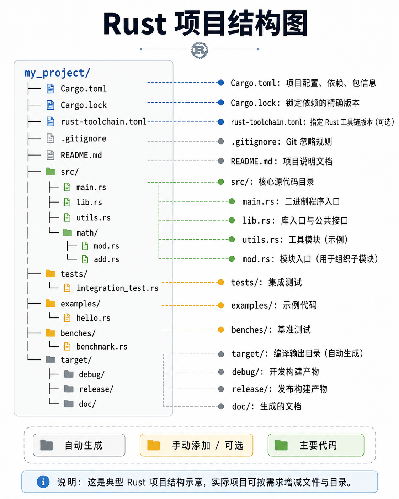

Rust 项目结构、模块系统与包管理

---

## 1️⃣ Rust 项目结构

Rust 项目通常由 **Cargo** 管理，Cargo 是 Rust 的官方包管理和构建工具。

更多cargo命令见[Cargo命令参考](../Cargo/Cargo命令.md)，本节不在介绍cargo 如何创建项目等操作。



### 项目根目录文件

| 文件 / 目录        | 作用                                                        | 结构概览                                                                                      |
| ------------------ | ----------------------------------------------------------- | --------------------------------------------------------------------------------------------- |
| `Cargo.toml`     | **项目配置文件**，管理 crate 信息、依赖、版本、特性等 | TOML 格式，包含 `[package]`、`[dependencies]`、`[dev-dependencies]`、`[workspace]` 等 |
| `Cargo.lock`     | **依赖锁定文件**，记录精确依赖版本，保证跨环境一致性  | 自动生成，列出每个 crate 的精确版本和来源                                                     |
| `toolchain.toml` | **可选手动添加**，指定 Rust toolchain 版本和 channel  | TOML 格式，如 `[toolchain] channel = "stable"`                                              |
| `target/`        | **构建输出目录**                                      | 编译生成的二进制文件、依赖 crate 编译产物、doc 文档等                                         |
| `.gitignore`     | Git 忽略文件配置                                            | 通常忽略 `target/`、`Cargo.lock`（库 crate 可选）                                         |
| `README.md`      | 项目说明文档                                                | Markdown 格式                                                                                 |
| `LICENSE`        | 许可证文件                                                  | 如 MIT、Apache 2.0 等                                                                         |
| `rustfmt.toml`   | **可选**，格式化规则                                  | 配置 rustfmt 行为                                                                             |
| `clippy.toml`    | **可选**，lint 规则                                   | 配置 clippy 检查规则                                                                          |

---

### `src/` 目录

| 文件 / 目录 | 作用                 | 结构概览                                     |
| ----------- | -------------------- | -------------------------------------------- |
| `main.rs` | 二进制 crate 入口    | `fn main() { ... }`                        |
| `lib.rs`  | 库 crate 入口        | 公共接口，通常声明模块和导出函数             |
| `mod.rs`  | 模块目录入口（可选） | 声明子模块 `pub mod xxx;`                  |
| 子模块文件  | 实现模块功能         | `xxx.rs` 或 `xxx/mod.rs`，内部函数和类型 |

**示例结构：**

```text
src/
├── main.rs
├── lib.rs
├── utils.rs
└── math/
    ├── mod.rs
    └── add.rs
```

---

### `tests/` 目录

* **集成测试**
* 每个文件作为一个测试模块，Cargo 会自动识别并执行

```text
tests/
└── integration_test.rs
```

**示例内容：integration_test.rs**

```rust
// 引入库 crate
use my_project::utils;
use my_project::math::add;

#[test]
fn test_add_function() {
    let result = add::add(2, 3);
    assert_eq!(result, 5);
}

#[test]
fn test_utils_uppercase() {
    let input = "hello";
    let output = utils::to_uppercase(input);
    assert_eq!(output, "HELLO");
}
```

---

### `examples/` 目录（可选）

* **示例代码**
* 用于演示库 crate 用法，`cargo run --example example_name` 执行

```text
examples/
└── hello.rs
```

---

### `benches/` 目录（可选）

* **性能测试**
* `cargo bench` 执行
* 常用 Criterion 库写基准测试

---

### `target/` 目录

* **编译输出目录**
* 包含：

  * `debug/` 和 `release/` 构建产物
  * 编译依赖的 crate（cargo build 缓存）
  * `doc/` 自动生成文档

**说明：** 不需要手动管理，由 Cargo 生成。

---

### Cargo 自动生成与手动添加文件总结

| 文件                          | 类型 | 是否自动生成      | 作用                     |
| ----------------------------- | ---- | ----------------- | ------------------------ |
| Cargo.toml                    | 配置 | 自动              | 项目信息、依赖、features |
| Cargo.lock                    | 锁定 | 自动              | 精确依赖版本             |
| toolchain.toml                | 配置 | 手动/可选         | 指定 Rust toolchain 版本 |
| target/                       | 输出 | 自动              | 编译产物、文档、缓存     |
| main.rs / lib.rs              | 代码 | 自动（cargo new） | 入口文件 / 库接口        |
| mod.rs / 子模块               | 代码 | 手动              | 模块组织                 |
| tests/ / examples/ / benches/ | 代码 | 手动可选          | 测试、示例、基准         |
| README.md / LICENSE           | 文档 | 手动可选          | 项目说明 / 许可证        |
| rustfmt.toml / clippy.toml    | 配置 | 手动可选          | 格式化 / Lint            |

---

## 2️⃣ Rust 模块系统

模块系统管理 **作用域和可见性**，允许将代码组织成清晰层次。

---

### 2.1 `mod` 声明

* 声明模块
* 可以在同文件或单独文件定义

**示例：单文件模块**

```rust
mod utils {
    pub fn add(a: i32, b: i32) -> i32 {
        a + b
    }
}

fn main() {
    let sum = utils::add(2, 3);
    println!("{}", sum);
}
```

**示例：多文件模块**

项目结构：

```
src/
├── main.rs
└── utils.rs
```

`main.rs`：

```rust
mod utils;   // 引入 utils.rs 文件

fn main() {
    let sum = utils::add(2, 3);
    println!("{}", sum);
}
```

`utils.rs`：

```rust
pub fn add(a: i32, b: i32) -> i32 {
    a + b
}
```

---

### 2.2 子模块

* 使用 `mod xxx;` 声明子模块
* 可以在 `mod.rs` 或目录下 `xxx.rs` 文件定义

示例项目结构：

```
src/
├── main.rs
└── math/
    ├── mod.rs
    └── add.rs
```

`math/mod.rs`：

```rust
pub mod add;    // 引入 add.rs
```

`math/add.rs`：

```rust
pub fn add(a: i32, b: i32) -> i32 {
    a + b
}
```

`main.rs`：

```rust
mod math;

fn main() {
    let sum = math::add::add(2, 3);
    println!("{}", sum);
}
```

---

### 2.3 可见性控制

Rust 的默认模块 **是私有的**，意味着模块内部的函数、结构体、常量等默认 **只能在当前模块内访问**。

要让其他模块或 crate 能访问，就需要使用 **`pub` 及其变体** 来控制可见性。

#### 可见性关键字

| 可见性           | 作用           | 访问范围                                     |
| ---------------- | -------------- | -------------------------------------------- |
| `pub`          | 公开           | 对**整个 crate** 或外部 crate 可见     |
| `pub(crate)`   | crate 内部可见 | 同一个 crate 内都可以访问，外部 crate 不可见 |
| `pub(super)`   | 父模块可见     | 仅对父模块和父模块的兄弟模块可见             |
| `pub(in path)` | 指定模块可见   | 只能在指定模块或其子模块访问                 |

---

#### 示例解析

假设项目结构如下：

```text
src/
├── main.rs
└── a/
    ├── mod.rs
    └── sub.rs
```

#### 示例代码

```rust
mod a {
    fn private_fn() {
        println!("只能在 a 模块内部访问");
    }

    pub fn public_fn() {
        println!("对外公开，可被 main.rs 调用");
    }

    pub(crate) fn crate_fn() {
        println!("在当前 crate 内可见，但外部 crate 不可访问");
    }

    pub(super) fn parent_fn() {
        println!("对父模块可见（main.rs 或兄弟模块）");
    }

    pub(in crate::a) fn in_module_fn() {
        println!("只在 a 模块或子模块可见");
    }
}
```

#### main.rs 调用规则

```rust
fn main() {
    a::public_fn();      // ✅ 可访问
    a::crate_fn();       // ✅ 可访问（同 crate）
    a::parent_fn();      // ✅ 可访问（main.rs 是父模块）
    // a::private_fn();  // ❌ 编译报错，私有
    // a::in_module_fn(); // ❌ 编译报错，不在指定模块范围
}
```

---

#### 可见性理解图（文字版）

```text
my_crate
│
├─ main.rs           <- 父模块
└─ a/ mod.rs         <- 子模块 a
      ├─ private_fn()        // 只在 a 内部
      ├─ public_fn()         // crate 内 + 外部 crate
      ├─ crate_fn()          // crate 内
      ├─ parent_fn()         // 父模块可见（main.rs）
      └─ in_module_fn()      // 仅在 a 模块或子模块
```

#### mod 默认行为

```rust
mod a { ... }
```

前面需不需要加 `pub`，这取决于 **你希望这个模块是否对外可见**:

---

##### `mod` 默认行为

* `mod a { ... }`

  * **默认是私有的**
  * 只在 **父模块** 内可见
  * 外部模块或 crate **不能直接访问**

---

##### `pub mod` 的作用

* 写成 `pub mod a { ... }`

  * 模块变成 **公共模块**
  * **父模块外部**可以访问
  * 在库 crate 中，外部 crate 可以用 `my_crate::a::foo()` 调用

**示例：库 crate**

```rust
// lib.rs
pub mod a {
    pub fn public_fn() {
        println!("外部 crate 可访问");
    }

    fn private_fn() {
        println!("仅 a 模块内部可访问");
    }
}
```

在外部 crate 调用：

```rust
// main.rs in other crate
my_crate::a::public_fn(); // ✅ 可访问
// my_crate::a::private_fn(); // ❌ 编译报错
```

---

##### 模块层级总结

| 声明                   | 模块可见性 | 访问范围                                                  |
| ---------------------- | ---------- | --------------------------------------------------------- |
| `mod a`              | 私有       | 父模块内可访问                                            |
| `pub mod a`          | 公共       | 父模块 + 父模块外可访问                                   |
| 子模块内部函数默认私有 | 私有       | 仅在该模块内部可访问                                      |
| 子模块内部函数 `pub` | 公共       | 父模块可访问，如果父模块 `pub mod`，外部 crate 也可访问 |

---

##### 小结

* **库 crate**：如果希望外部 crate 使用模块，`pub mod a` 必须加 `pub`
* **二进制 crate / 内部模块**：通常不用 `pub`，默认私有即可
* **模块内部的函数、类型**：再用 `pub` 或可见性修饰符控制访问范围

---

### 2.4 导入、使用函数

分为两种情况: 有lib.rs 无lib.rs

#### 没有 lib.rs（纯二进制 crate）

假设项目：

```text
src/
├── main.rs            //main.rs 是根模块,并声明了 math 模块和 utils 模块 mod utils; mod math;
├── utils.rs
└── math/
    ├── mod.rs
    └── add.rs
```

编译器查找顺序：

mod utils; → 查找 src/utils.rs 或 src/utils/mod.rs （两者按照道理不会同时存在）
mod math; → 查找 src/math.rs 或 src/math/mod.rs （两者按照道理不会同时存在）

总结：根模块（main.rs）是入口 → 模块声明 → 模块路径解析 → use 按模块层级查找。

##### 有 lib.rs（库 crate）

假设项目：

```text
src/
├── main.rs
├── lib.rs          //lib.rs 声明模块 pub mod utils;  pub mod math;
├── utils.rs
└── math/
    ├── mod.rs
    └── add.rs
```

编译器查找顺序：

crate 根是 lib.rs
按 pub mod 声明顺序查找模块文件
    utils → `src/utils.rs` 或者 `src/utils/mod.rs`
    math → `src/math.rs` 或者 `src/math/mod.rs`

注意：外部 crate 调用你的库总是从 lib.rs 根开始（用 `crate::` 或 `my_crate::` 路径）

#### 如果项目有 lib.rs，main.rs 想使用 math/add.rs 中的函数，有哪些导入方式

以有 lib.rs（库 crate）为例，导入 `math/add.rs` 中的函数，有哪些导入方式

1.通过 lib.rs 中重新导出函数（lib.rs中声明了 pub mod math; ）

```rust
use my_project::add;   // 直接使用重新导出的函数

fn main() {
    let result = add(5, 6);
    println!("5 + 6 = {}", result);
}
```

2.通过 mod math 直接导入

```rust
mod math;
use math::add::add;  

fn main() {
    let result = add(2, 3);
    println!("2 + 3 = {}", result);
}
```

#### Rust 模块文件查找原则

1、默认情况下，Rust 只会在 crate 根（src/）及其子目录 查找模块。
2、mod xxx; 会去以下路径查找：
    xxx.rs
    xxx/mod.rs
3、如果模块不在 `src/` 内部，编译器不会自动找到，除非通过 路径引入或 workspaces。

```text
my_project/
├── Cargo.toml
├── src/
│   └── main.rs
└── math/
    └── add.rs
```

这里 math/ 不在 src/ 内，所以：

直接写 mod math; 会报错，编译器找不到 `src/math.rs` 或 `src/math/mod.rs`
需要告诉 Rust 显式路径 或 把 math 变成 crate（workspace）的一部分）

把 math 作为子 crate,通过 `path` 依赖进行声明（ 或者构建workspace，math 下新创建 Cargo.toml）

### 2.5 Rust 导入路径：`crate::` vs `my_crate::`

1、 `crate::`
    - 表示当前 crate 根
    - 只在同一个 crate 内部使用
    - 可以从根模块（lib.rs 或 main.rs）开始相对引用模块和函数
    - 常用于库内部模块之间调用
    - `crate::` 只能在 同一个 crate 内使用，外部 crate 不可用。
2、`my_crate::`
    - 表示外部 crate 的名称
    - 外部 crate 调用你的库时使用
    - crate 名就是你在 Cargo.toml中[package] name = "my_crate" 中定义的名称
    - 外部 crate 必须通过 crate 名来访问，你不能用 `crate::`，因为 `crate::` 指的是调用者自己的根模块。

## 3️⃣ Crate 与包管理

### 3.1 crate 类型

* **二进制 crate**：生成可执行程序，入口 `main.rs`
* **库 crate**：提供可复用代码，入口 `lib.rs`
* 一个 Cargo 项目可以同时包含二进制 crate 和库 crate。

---

### 3.2 依赖管理

#### 依赖类型

```toml
[dependencies]
regex = "1"                  # 精确版本
serde = { version = "1.0", features = ["derive"] }  # 启用特性

[dev-dependencies]

[build-dependencies]

```

1、[dependencies]：声明项目运行依赖

```toml
[dependencies]
rand = "0.8"
```

Cargo 会下载 crate 并在构建时编译，默认导入到项目中可直接 use rand::Rng;

2、[dev-dependencies]：开发依赖（测试、示例代码）

```toml
[dev-dependencies]
criterion = "0.4"
```

只在测试或基准测试中使用,cargo build 不会编译 dev-dependencies,cargo test 或 cargo bench 会编译

3、[build-dependencies]：构建脚本依赖

```toml
[build-dependencies]
cc = "1.0"
```

仅用于构建脚本 build.rs,编译时 Cargo 会使用这些依赖生成文件或处理构建任务

4、可选依赖 / features

4.1 可选依赖（optional dependency）
    - 一个依赖 **不一定总被编译**
    - 只有在需要时才启用，节省编译时间和二进制大小
    - 常用于库 crate，允许用户选择功能模块

```toml
[dependencies]
serde = { version = "1.0", optional = true ,features = ["derive"]}  # optional = true 表示可选 ,依赖不默认编译
```

4.2 Features
    - 用来 **组合可选依赖或控制功能**
    - 可以在 Cargo.toml 中声明，默认启用或手动启用
    - 控制是否启用 optional 依赖或功能

```toml
[features]
default = []                  # 默认启用的依赖有[]中的内容，此处为空，默认没有任何 feature 启用
json_support = ["serde_json"] # json_support feature 启用 serde/json
```

4.3 main.rs 或库代码中使用可选依赖

```rust,ignore
#[cfg(feature = "json_support")]   // 仅在 feature 启用时编译
pub fn parse_json(s: &str) -> serde_json::Value {
    serde_json::from_str(s).unwrap()
}
```

`#[cfg(feature = "xxx")] `宏控制 编译条件,如果用户没启用 json_support，这段代码不会编译.

4.4 如何启用 Features

```toml
[dependencies]
serde_json = { version = "1.0", optional = true }

[features]
default = []
json = ["serde_json"]
```

可选依赖只有在指定 feature 时才会编译,通过 --features json 激活,`cargo build --features json_support`。默认构建 `cargo build `（不启用任何 feature） 启用多个 feature（假设有多个）`cargo build --features "json_support other_feature"`

---

#### 版本管理规则

Cargo 遵循 语义化版本（SemVer）：

`MAJOR.MINOR.PATCH`

1、`^` 号（Caret）：默认依赖策略

`serde = "^1.0"  # >=1.0.0, <2.0.0`

2、`~` 号（Tilde）：仅允许小版本更新

`serde = "~1.0.115"  # >=1.0.115, <1.1.0`

3、`=` 号（Equal）：指定精确版本：

`serde = "=1.0.115"  # 仅 1.0.115`

4、`*` 号（Star）：指定通配符：

`serde = "1.*"  # >=1.0.0, <2.0.0`

### 3.3 Rust Workspace（工作区）结构

Workspace 概念
    - Workspace 是 多个 crate 的组合
    - 共享同一个 Cargo.lock
    - 可以统一构建、测试和管理依赖
    - 常用于大型项目或多个相关 crate 的组织

Workspace 根目录
    - 根目录 必须有 Cargo.toml，声明 workspace 成员
    - 根目录下通常不放源码，源码在各个子 crate 中

**示例：**

```text
my_workspace/
├── Cargo.toml         # workspace 根配置
├── crate_a/           # 第一个 crate
│   ├── Cargo.toml
│   └── src/
│       └── lib.rs
├── crate_b/           # 第二个 crate
│   ├── Cargo.toml
│   └── src/
│       └── main.rs
└── target/            # 构建输出，workspace 共享
```

根 Cargo.toml 配置:

```toml
[workspace]
members = [
    "crate_a",
    "crate_b",
]

[workspace.dependencies]
//内部依赖
crate_a = { path = "../crate_a" }
crate_b = { path = "../crate_b" }
//外部依赖
serde = { version = "1.0" ,features = ["derive"]}

```

members 列出 workspace 内的所有 crate, 可以是相对路径，也可以是子目录

1 子 crate 相互依赖

假设 crate_b 依赖 crate_a：

```toml
[dependencies]
crate_a = { workspace = true }  # 路径依赖
```

main.rs 中调用：

```rust,ignore
use crate_a::some_function;

fn main() {
    some_function();
}
```

2 Workspace 优点
    - 统一管理依赖，避免重复下载
    - 多 crate 构建和测试统一
    - 子 crate 相互依赖方便（用 path）
    - 适合大型项目和库 + 可执行程序组合

---
